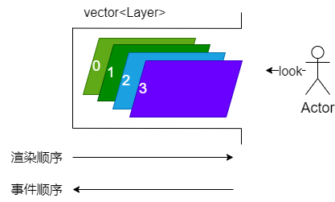

## Layer
为了更好管理渲染引擎中的各类事物，提出图层的概念。

图层有两种

1. Layer：普通层
2. Overlay：覆盖层，覆盖在所有Layer之上

## LayerStack

LayerStack：本质上是vector<Layer>的包装器

```
0, 1, 2, ...., size-1
0是栈底; size-1是栈顶
相对于眼睛来说，size-1更在前面（更接近眼睛），0被压在后面

渲染顺序：0, 1, 2, ..., size-1
    因为，先渲染0, 再渲染1, 1覆盖0

事件顺序：size-1, ..., 2, 1, 0
    例如点击事件, 先点击到size-1, ..., 最后点击到0
```

事件顺序

